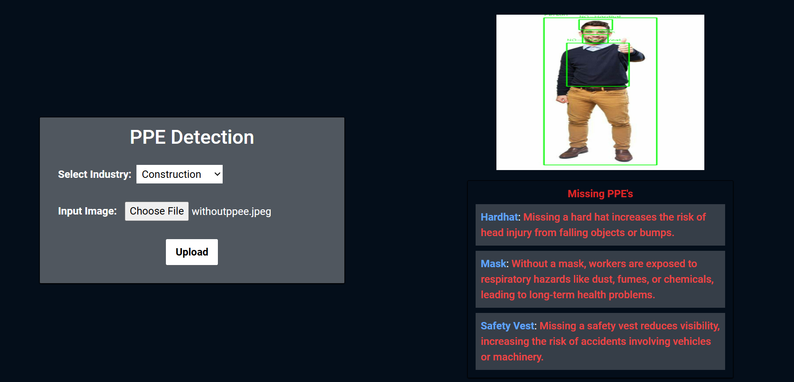

# PPE Detection System

This is a web-based Personal Protective Equipment (PPE) detection system to enhance workplace safety by identifying compliance with safety standards, such as wearing helmets and vests. The system uses computer vision for detection and is deployed as a web application for ease of access.

## Key Features

- **PPE Detection:** Detects and classifies PPE such as hardhats, masks, and safety vests in images.
- **Industry-Specific Safety Information:** Provides safety messages based on the industry (e.g., Construction, Manufacturing) and missing PPE.
- **Image Upload and Processing:** Users can upload images, which are processed for PPE detection.
  
### Example Images

- **Without PPE**: An example showing worker without the required PPE.
  

- **With PPE**: An example showing worker with the required PPE.
  

## Endpoints

### 1. **POST /upload**

**Description:** Allows users to upload an image for PPE detection.

**Parameters:**
- **file (file):** The image file containing workers.
- **industry (form data):** The industry for which PPE requirements and safety warnings are calculated.

**Response:**
Returns a JSON with:
- **detected_ppe:** List of PPE detected in the image.
- **missing_ppe:** List of PPE that is missing, based on the industry.
- **safety_message:** Safety warnings for each missing PPE.

