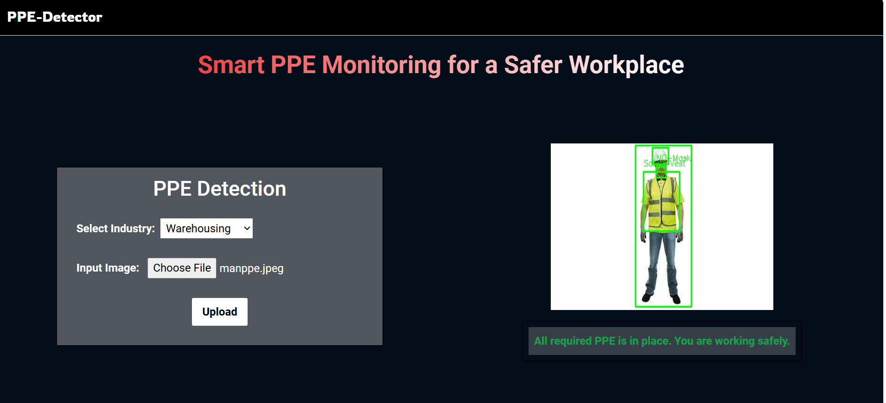

# PPE Detection System👷‍♂️  

This is a web-based **Personal Protective Equipment (PPE) Detection System** designed to enhance workplace safety by identifying compliance with safety standards. The system detects the presence or absence of key PPE such as helmets, masks, and safety vests, using the state-of-the-art **YOLOv8** object detection model. It is implemented as a web application using **React** for the frontend and **Flask** for the backend.  

---

## Key Features  

- **PPE Detection:** Detects and classifies PPE items like hardhats, masks, and safety vests using the YOLOv8 model.  
- **Industry-Specific Requirements:** Customizes PPE detection and safety recommendations based on the user's specified industry (e.g., Construction, Manufacturing).  
- **Image Upload and Processing:** Allows users to upload images, which are analyzed to detect the presence or absence of required PPE.  
- **Fast and Accurate:** YOLOv8 ensures real-time, high-speed, and precise PPE detection.  
- **Annotated Feedback:** Displays processed images with bounding boxes around detected items and provides a list of detected and missing PPE.  

---

## Step-by-Step Working  

### 1. **Image Upload**  
- Users upload an image of workers via the web interface.  
- Users specify the **industry type** to apply customized PPE requirements.  

### 2. **Image Processing and Detection**  
- The image is sent to the **Flask backend** for processing.  
- **YOLOv8**, fine-tuned on a PPE-specific dataset, identifies and classifies objects such as hardhats, masks, safety vests, and more.  

### 3. **PPE Validation**  
- Detected PPE is compared against the mandatory requirements for the specified industry.  
- The system identifies any missing PPE.  

### 4. **Safety Message Generation**  
- Based on missing PPE, industry-specific safety warnings and recommendations are generated.  

### 5. **Results Display**  
- Results include:  
  - **Detected PPE:** List of all PPE detected in the image.  
  - **Missing PPE:** Items absent but required.  
  - **Safety Messages:** Tailored warnings based on missing PPE.  
  - **Annotated Image:** Image with bounding boxes around detected PPE items.  
- Users can view these results directly on the web application.  

---

## Dataset and Model Details  

The **YOLOv8 model** used in this system has been fine-tuned on a PPE-specific dataset with the following 10 labels:  
1. **Hardhat**  
2. **Mask**  
3. **NO-Hardhat**  
4. **NO-Mask**  
5. **NO-Safety Vest**  
6. **Person**  
7. **Safety Cone**  
8. **Safety Vest**  
9. **Machinery**  
10. **Vehicle**  

The dataset was curated to ensure high precision and recall for workplace safety scenarios. The fine-tuning process involved augmenting images with various angles, lighting conditions, and diverse worker scenarios to improve robustness.  

---

## API Endpoints  

### 1. **POST /upload**  

**Description:**  
Enables users to upload an image for PPE detection.  

**Request Parameters:**  
- **file (file):** The image file to be analyzed.  
- **industry (form data):** Industry type to determine PPE requirements.  

**Response:**  
Returns a JSON object containing:  
- **detected_ppe:** List of PPE items detected in the image.  
- **missing_ppe:** List of PPE items that are required but missing based on the industry.  
- **safety_message:** Safety recommendations and warnings for each missing PPE item.  
- **annotated_image:** A URL or base64-encoded image with bounding boxes highlighting detected PPE.  

---

## Example Images  

- **Without PPE:**  
  Example of a worker without the required PPE.  
    

- **With PPE:**  
  Example of a worker fully compliant with PPE requirements.  
    

---

This system is designed to improve workplace safety and ensure compliance with industry-specific PPE standards, making it a valuable tool for safety inspectors and organizations.
